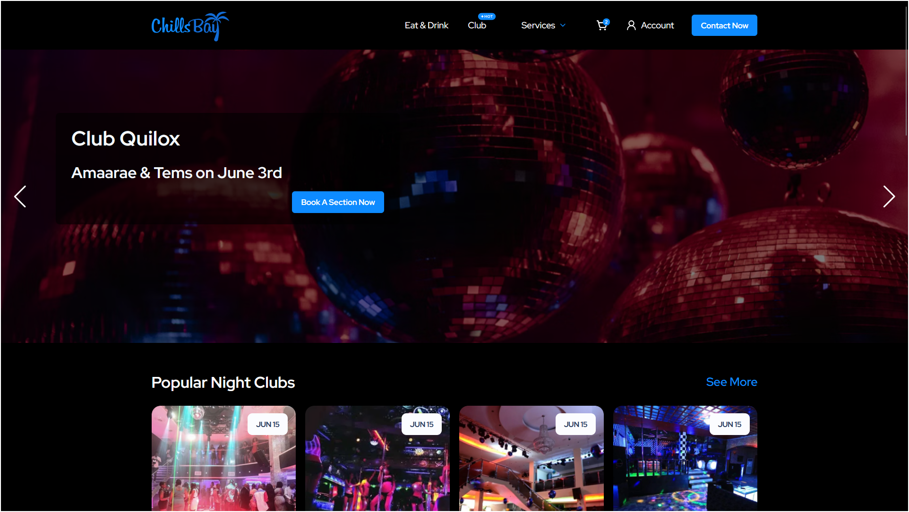

# Chills Bay Big React Project 

## 🖥️ Project Overview  
**Chills Bay** is a modern and responsive website built using **React.js**,**React-Router-Dom** and **Tailwind CSS**, based on a Figma design. The project aims to deliver a sleek user interface and seamless user experience.  

### ✨ Features  
- Responsive design (Mobile-first approach)  
- Custom navigation bar and hero section  
- Modern UI components  
- Fast loading speed (powered by Tailwind CSS)  
- SEO-friendly structure  

---

## 🚀 Live Demo  
Check out the live website [here](https://chills-bay-big-react-tailwind-project.vercel.app/).

---

## 🛠️ Technologies Used  
- **React.js**: Front-end framework  
- **React-Router-Dom**: Used to build single-page applications file routs
- **Tailwind CSS**: Utility-first CSS framework  
- **Vercel**: Hosting platform  

---

## 📂 Project Structure  
```plaintext
├── src
│   ├── components   // Reusable components
│   ├── pages        // Page-based folder structure
│   ├── assets       // Images and media files
│   └── App.js       // Main application file
├── public           // Public assets
└── README.md        // Project documentation
```

---

## ⚙️ Installation & Setup  

**Follow these steps to run the project locally:**  

1. **Clone the repository**:  
   ```bash
   git clone https://github.com/AdalOnShow/chills-bay-big-react-tailwind-project.git
   ```

2. **Navigate to the project directory**:  
   ```bash
   cd chills-bay-big-react-tailwind-project
   ```

3. **Install dependencies**:  
   ```bash
   npm install
   ```

4. **Run the development server**:  
   ```bash
   npm run dev
   ```  

5. Open your browser and visit:  
   [http://localhost:3000](http://localhost:3000)  

---

## 📸 Screenshots  
### Home Page  
  

### Club Page  
  

---


## 🧑‍💻 Author  
**Sharif H. Adal**  
- **Portfolio**: https://sharif-adal.vercel.app
- **GitHub**: [AdalOnShow](https://github.com/AdalOnShow/)  
- **LinkedIn**: [AdalOnShow](https://www.linkedin.com/in/adalonshow/) 

---

## 🤝 Contribution  
Contributions are welcome! Report issues or suggest new features.  

1. **Fork the repository**  
2. **Create a new branch**  
   ```bash
   git checkout -b feature/your-feature-name
   ```
3. **Commit your changes**  
   ```bash
   git commit -m "Added new feature"
   ```
4. **Push to the branch**  
   ```bash
   git push origin feature/your-feature-name
   ```
5. **Open a Pull Request**  

---

## Thanks..👍